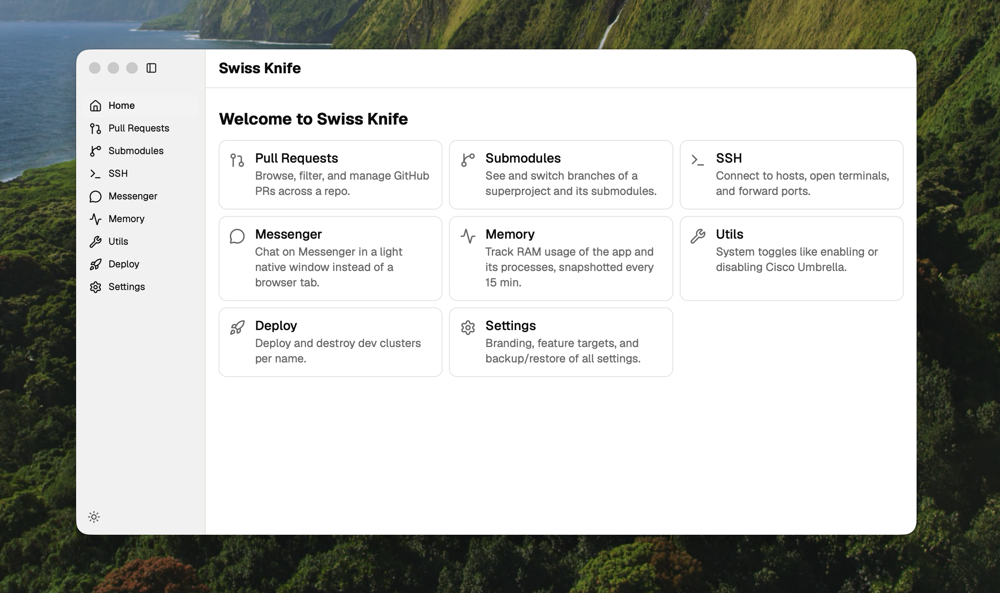

<div align="center">

# 🔪 Personal Swiss Knife

**Every dev chore you keep a browser tab, a terminal, and three CLIs open for — in one tiny native app.**

Browse PRs, hop git submodule branches, SSH + port-forward, deploy dev clusters, chat, and watch memory — from a single window that boots in under a second.

[](https://tauri.app)
[](https://react.dev)
[](https://www.typescriptlang.org)
[](https://www.rust-lang.org)
[](https://vitejs.dev)



</div>

---

## Why

You already have the tools. What you don't have is one place for them. This is a desktop **swiss knife** — a Tauri v2 app (Rust backend, React 19 frontend) that folds the boring, repeated dev tasks into one fast, native, dark-mode window. No Electron bloat, no ten browser tabs, no `alt-tab` roulette.

## ✨ What's inside

| Tool | What it does |
|------|--------------|
| 🔀 **Pull Requests** | Browse, filter, and manage GitHub PRs across a repo without leaving the app. |
| 🌿 **Submodules** | See and switch branches of a superproject *and* all its submodules at a glance. |
| 💻 **SSH** | Connect to hosts, open real terminals (xterm), and forward ports. |
| 💬 **Messenger** | Chat on Messenger in a light native window instead of a heavy browser tab. |
| 📈 **Memory** | Track RAM of the app and its processes, snapshotted every 15 min, charted. |
| 🧰 **Utils** | One-click system toggles (e.g. enable/disable Cisco Umbrella). |
| 🚀 **Deploy** | Spin up and tear down named dev clusters. |
| ⚙️ **Settings** | Custom branding, feature targets, and full backup/restore of every setting. |

## 🚀 Quick start

```bash
# 1. clone
git clone https://github.com/Arif-un/personal-swiss-knife.git
cd personal-swiss-knife

# 2. install (pnpm only — never npm/yarn)
pnpm install

# 3. run the desktop app
pnpm tauri dev
```

That's it. First run compiles the Rust side; later runs are instant.

### Prerequisites

- [pnpm](https://pnpm.io) — the package manager for this repo
- [Rust toolchain](https://www.rust-lang.org/tools/install) — for the Tauri backend
- Tauri v2 [system deps](https://tauri.app/start/prerequisites/) for your OS

### Build a release

```bash
pnpm release:mac     # macOS bundle
pnpm release:linux   # Linux bundle
```

## 🧱 Tech stack

- **Shell:** Tauri v2 (Rust) — native, tiny, secure
- **UI:** React 19 + TypeScript + Vite 7
- **Routing/data:** file-based TanStack Router + TanStack Query
- **Styling:** Tailwind v4 + shadcn + `@base-ui/react`
- **Charts:** Recharts · **Terminal:** xterm.js · **Icons:** lucide

## 🗂️ Project layout

```
src/routes/            one file per page (deploy, memory, messenger, pull-requests, ssh, utils, ...)
src-tauri/src/<feat>/  Rust per feature (devkon, github, memtrack, messenger, ssh, utils)
docs/memory/           lazy-loaded, feature-specific notes
```

Each feature is self-contained: a route on the frontend, a `commands.rs` on the backend registered in `lib.rs`.

## 🤝 Contributing

PRs welcome — the setup is deliberately friction-free.

1. **Fork & branch:** `git checkout -b feat/my-thing`
2. **Code.** Follow the existing feature pattern (route + `<feature>/commands.rs`).
3. **Verify before you push** — this is the one rule that matters:
   ```bash
   pnpm fix     # auto-fix JS + Rust (oxfmt, oxlint, cargo fmt, clippy)
   pnpm check   # verify everything is clean (CI runs this)
   ```
   > ⚠️ Clippy runs with `-D warnings` — a single warning fails CI. `pnpm check` catches it locally.
4. **Open a PR.** Clear title, what + why.

Tooling note: this repo uses **pnpm + oxlint + oxfmt** — not npm/eslint/prettier.

## 📸 More screenshots

Add more captures to `docs/screenshots/` and drop them anywhere in this README. Grab them straight from `pnpm tauri dev`.

---

<div align="center">

Built with 🦀 Rust + ⚛️ React. Star it if it saves you a tab.

</div>
